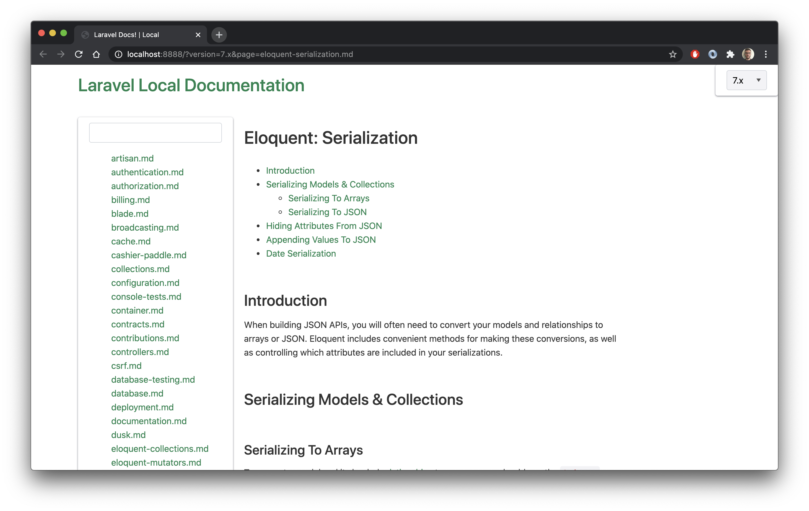

# Build laravel documentation locally

This repo contains code that i daily using for keeping track of laravel documentation changes and seeing these changes locally.

> If you want to build whole laravel documentation website you need to clone [laravel/laravel.com-next](https://github.com/laravel/laravel.com-next) also you should follow theirs readme file for installing locally.

---

For updating documents you need to run [update.php](update.php) file. You may use this alias.

```bash
laravel-document-update() {
    LD_BASE_DIRECTORY=/Code/laravel-documentation

    php $LD_BASE_DIRECTORY/update.php

    cd $LD_BASE_DIRECTORY/docs
}
```

With this update i can which files has been changed in documentation and to see file contents cd into docs folder and run `git diff HEAD@{1}`.

If you want to run in browser, you will need a html server or use php built-in http server like me :) (Or whatever you want, just need to serve a single html file)

For making it easy, i am using this alias.

```bash
laravel-doc() {
    LD_BASE_DIRECTORY=/Code/laravel-documentation

    if nc -z 127.0.0.1 8888; then
        open http://localhost:8888
    else
        cd $LD_BASE_DIRECTORY && 
        open http://localhost:8888 && 
        nohup php -S 127.0.0.1:8888 &
    fi
}
```

After adding `laravel-doc` function to `.bashrc` file you may write laravel-doc to terminal and it will open browser tab.

Here is the example output.


